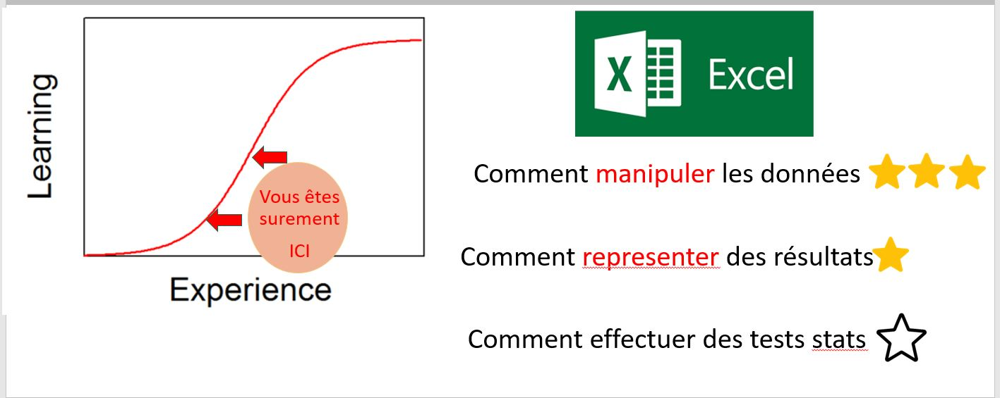
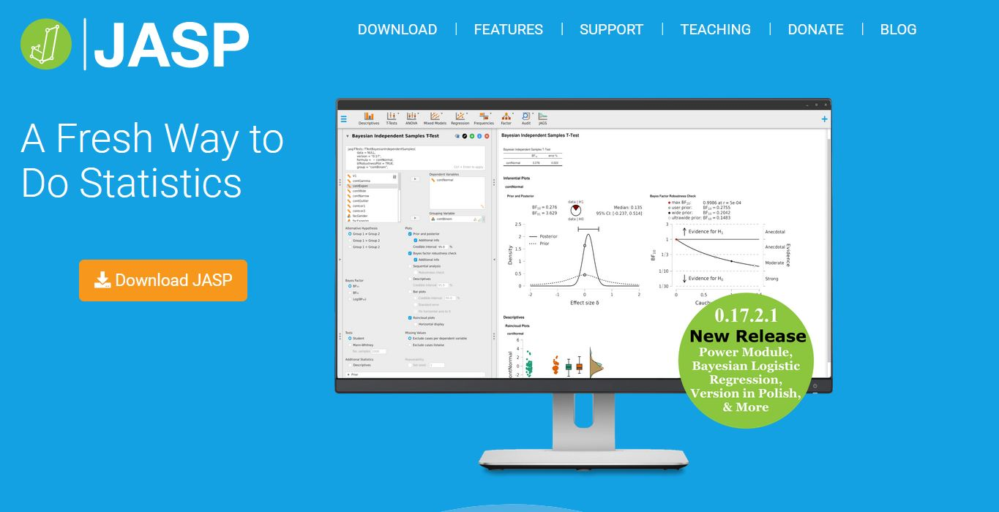
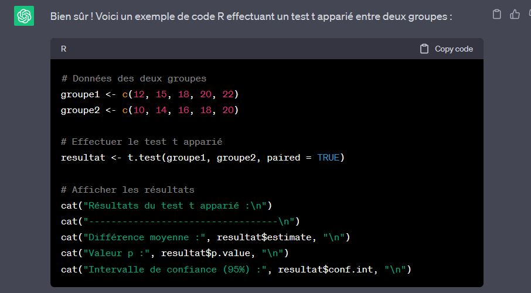
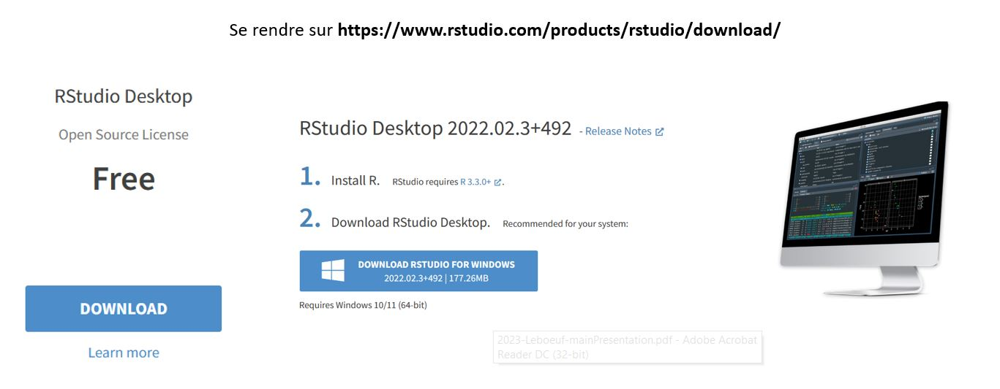
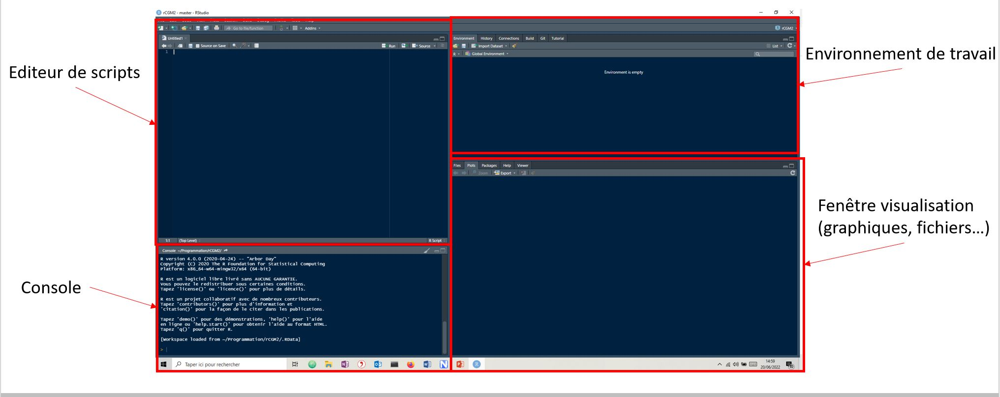
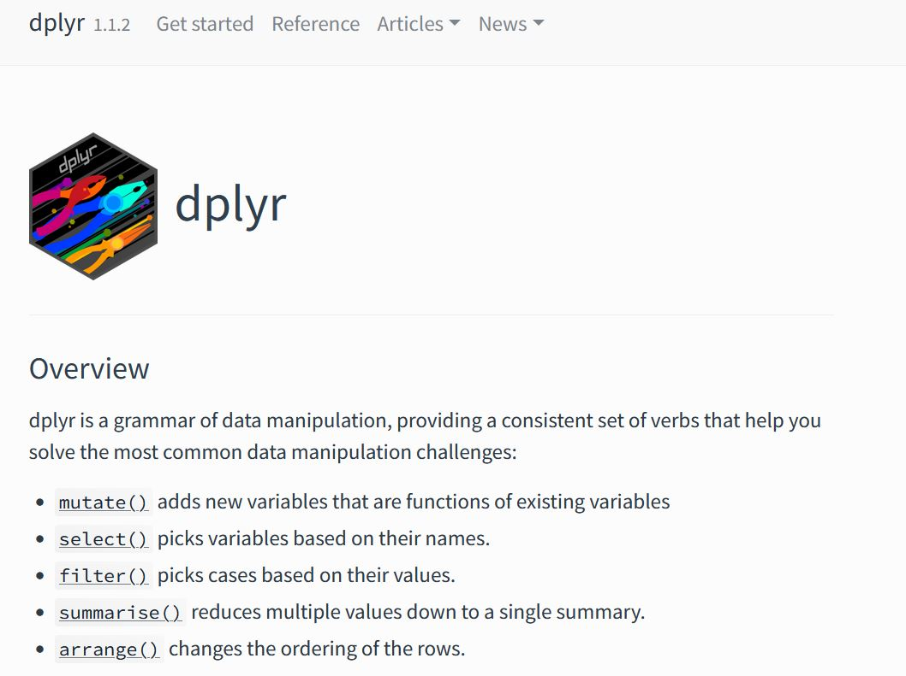
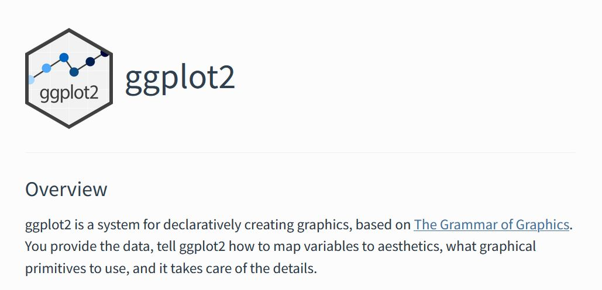
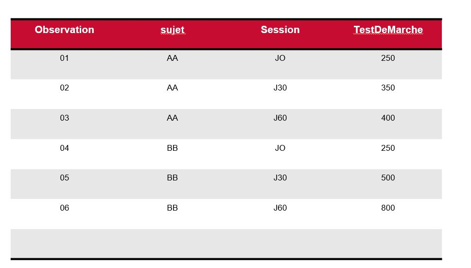
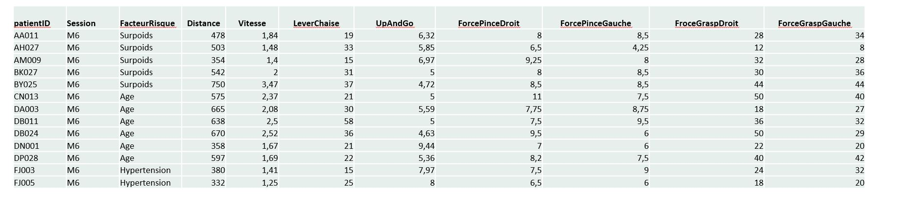

```{r setup, include=FALSE}
knitr::opts_chunk$set(echo = TRUE)
```


Ce document n'est ni **un cours de statistique**, ni **un cours de programmation**.

Les objectifs : 

 * manipuler des données
 * representer les données
 * effectuer des tests statistiques de base


## Excel, fait déja tout ca !



## Des alternatives existent  

Voici quelques logiciels de référence 


Ces logiciels sont très **performants** et très **bien documentés**. 
Mais ils sont **PAYANTS**. 


## Une solution gratuite séduisante

*Jasp* est une solution



JASP <https://jasp-stats.org/> est **un logiciel d'analyse statistique** et de traitement de données relativement récent, qui se concentre sur la simplicité d'utilisation et l'accessibilité pour les utilisateurs novices en statistiques. 

Si vous préférez une interface conviviale et une approche plus simplifiée de l'analyse statistique, JASP peut être un choix approprié. Cependant, si vous avez besoin : 
 
 * d'une plus grande flexibilité, 
 * de capacités avancées d'analyse statistique 
 * et de la possibilité de personnaliser vos analyses
 
alors, il faut employer une solution plus robuste.

## Une solution robuste Rstudio

### Avantages de Rstudio :

**Flexibilité et polyvalence** : Rstudio permet d'effectuer une grande variété de tâches de traitement de données, comprenant  : 
      * la manipulation
      * la transformation
      * l'analyse statistique
      * la visualisation. 
=> Rstudio offre contrôle complet sur vos analyses et vous permet d'adapter les méthodes et les techniques en fonction de vos besoins spécifiques.

**Communauté active et ressources étendues** : RStudio, s'appuie sur  est un langage open-source : R, disposant d'une communauté active et engagée d'utilisateurs et de développeurs. Cela signifie qu'il existe une vaste bibliothèque de packages R disponibles, couvrant un large éventail de domaines d'analyse et de visualisation des données. 

**Capacités avancées d'analyse statistique** Si vous avez besoin d'effectuer des analyses statistiques avancées sur vos données, RStudio vous offre un éventail d'outils puissants pour le faire.

**Reproductibilité et AUTOMATISATION** : RStudio favorise la reproductibilité de vos analyses. Vous pouvez écrire des **scripts** qui enregistrent toutes les étapes de votre traitement de données, de sorte que les analyses puissent être reproduites facilement par vous-même ou par d'autres chercheurs. Cela facilite également l'automatisation des tâches répétitives. 

=> **Script** signifie accumulation de lignes de code !!
<center>
 
</center>

Heureusement, **ChatGPT** est là pour vous 

 


### installation




### Interface graphique




### dplyr/ggplot2 => 2 packages (librairies) alliant performance et intuitivité


**qu est ce qu'un package ? ** Un package est une collection de fonctions, de données et de documentation regroupées pour effectuer des tâches spécifiques. Les packages sont conçus pour étendre les fonctionnalités de base de R. Ils permettent aux utilisateurs de bénéficier d'une grande variété d'outils et de techniques développés par la communauté.


 1. **Le package dplyr**  : dplyr est un package R conçu pour faciliter la manipulation et la transformation des données. Il offre un ensemble **de fonctions puissantes et intuitives** qui permettent d'effectuer des opérations simples et courantes sur les données 
<center>

</center>

 2. **Le package ggplot2** : ggplot2 est un package qui permet de créer des graphiques. Il repose sur **une grammaire** offrant une grande flexibilité dans la création de graphiques

<center>

</center>
 
En combinant ces 2 packages (dplyr, ggplot2), vous disposez d'un ensemble puissant d'outils pour importer, manipuler, nettoyer, transformer, analyser et visualiser vos données dans R.

**Pour ceux qui veulent aller plus loin**, tidyR est un complément idéal.


## Passons à la pratique


### Prealable indispensable sur la structuration des données

Votre tableau de données doit respecter les règles suivantes

 * Chaque variable correspond à une colonne 
 * Chaque observation correspond à une ligne 

exemple : 

<center>

</center>

Il est recommandé : 

 - d éviter les accents
 - d'éviter de mettre des espaces dans les noms ( opter plutot pour un formatage *CamelCase* des labels longs)


### Le jeu de données

Il s 'agit d 'un jeu de données *fictifs*, effectuant le suivi de patient COVID

<center>

</center>

Les données ont été collectées au cours de plusieurs sessions (M6-M9-M12-M18)

les données sont dans un fichier excel : *CovidData_demo.xlsx*

### Manipulons les données

l 'objectif est de vous familiariser avec les verbes de dplyr : 

 * select
 * filter 
 * arrange 
 * mutate 
 * summarize
 
Dans la suite du document, j exposerai les codes R que vous pourrez copier/coller, 
les uns après les autres dans votre script R afin de reproduire le traitement


#### chargement des libraries**
```{r import, echo=TRUE, results = 'hide'}
library(tidyverse) # importation de TOUTES libraires du site tidyverse ( inclus dplyr et ggplot2)
library(readxl) # librairie permettant de lire les fichiers excel
``` 

#### chargement des données
```{r , echo=TRUE}

dataTable = read_excel("CovidData_demo.xlsx",sheet= "Feuil1") # si le fichier excel est dans le meme repertoire que le script R, sinon, renseigner le chemin complet comme dans l'exemple ci dessous

dataTable = read_excel("C:\\Users\\fleboeuf\\Documents\\my Seminars\\2023- presentation Interne Data\\CovidData_demo.xlsx",sheet= "Feuil1")

dataTable #affichage de dataTable
head(dataTable,3) #affichage des 3 premieres lignes
``` 

#### la grammaire dplyr

**verbe select - reduction du tableau par selection de colonnes**

le code ci-dessous passe *dataTable* a la fonction *select* et retourne une nouvelle table *table_select*

```{r , echo=TRUE}
table_select = dataTable %>% 
  select(patientID,Session,Distance) # l operateur %>% permet de passer dataTable a la fonction select

table_select
``` 

**verbe filter - reduction du tableau par filtrage des lignes **

le code ci-dessous passe *dataTable* a la fonction *filter* et retourne une nouvelle table *table_ex1*

```{r , echo=TRUE}
table_ex1 = dataTable %>%
  filter(Session == "M6" & ForceGraspGauche> 8)

table_ex2 = dataTable %>%
  filter(Session == "M6" &  patientID == "AA011" )

table_ex3 = dataTable %>%
  filter(Session == "M6" &  patientID != "AA011" )

table_ex2

``` 

**verbe arrange - reorganisation des lignes **

le code ci-dessous passe *dataTable* a la fonction *arrange* et retourne une nouvelle table *table_ex1*

```{r , echo=TRUE}
table_ex1 = dataTable %>%
  arrange(Distance) # distance va du plus petit a plus grand

table_ex1

``` 

**verbe mutate - ajout de nouvelle colonne **

La fonction dplyr::mutate permet d'ajouter de nouvelles variables ou de transformer les variables existantes dans un tableau de données en utilisant des expressions ou des opérations spécifiées.

le code ci-dessous passe *dataTable* a la fonction *mutate* et retourne une nouvelle table *table_ex1*

```{r , echo=TRUE}
table_ex1 = dataTable %>%
   mutate(VitesseKmh = Vitesse*3.6,
          Vitesse = Vitesse/2) # ajout de 1 nouvelle colonne et modification de la colonne Vitesse

table_ex1

``` 

**verbe summarise - ajout de nouvelle colonne **

La fonction dplyr::summarise permet de résumer les données d'un tableau en calculant des statistiques descriptives pour une ou plusieurs variables spécifiées, générant ainsi un résumé compact .

le code ci-dessous passe *dataTable* a la fonction *summarise* et retourne une nouvelle table *table_ex1*

```{r , echo=TRUE}
table_ex1 = dataTable %>%
   summarise( moyenneVitesse = mean(Vitesse,na.rm=TRUE),  
              stdVitesse = sd(Vitesse,na.rm=TRUE))

table_ex1

``` 

*summarise* est plus utile pour recuperer les statistiques descriptives par groupe. 
Cette operation se fait trés simplement en explicitant le regroupement dans *group_by*

```{r , echo=TRUE}
table_ex1 = dataTable %>%
  group_by(patientID,Session)%>%
  summarise(moyenneVitesse = mean(Vitesse,na.rm=TRUE),
            stdVitesse = sd(Vitesse,na.rm=TRUE))

table_ex1

table_ex1 = dataTable %>%
  group_by(FacteurRisque)%>%
  summarise(moyenneVitesse = mean(Vitesse,na.rm=TRUE),
            stdVitesse = sd(Vitesse,na.rm=TRUE))

table_ex1


``` 


#### Faire une phrase avec la grammaire dplyr 

La section précédente présentait les verbes principaux de dplyr. Vous avez pu constater la présence de l'operateur *%>%*. 
Cet operateur va nous permettre de cumuler les differents verbes, pour traiter les données en un seul bloc

Par exemple, dans le code suivant,:

1. Sélectionne les colonnes "patientID", "Session" et "Vitesse".
2. Filtre les lignes où la colonne "Session" est différente de "M6".
3. Ajoute une nouvelle colonne appelée "VitesseKmh" qui est calculée en multipliant la colonne "Vitesse" par 3.6.
4. Regroupe les données par les colonnes "patientID" et "Session".
5. Résume les données groupées en calculant la moyenne de la colonne "VitesseKmh" pour chaque groupe, en ignorant les valeurs manquantes (NA), et stocke le résultat dans une nouvelle colonne appelée "moyenneVitesse".

```{r , echo=TRUE}
table_ex1 = dataTable %>%
  select(patientID,Session,Vitesse)%>%
  filter(Session != "M6")%>%
  mutate(VitesseKmh = Vitesse*3.6)%>%
  group_by(patientID,Session)%>%
  summarise(moyenneVitesse = mean(VitesseKmh,na.rm=TRUE))

table_ex1


``` 


### Visualisation des données - introduction a ggplot2

ggplot2 utilise **une grammaire** , qui permet de créer des visualisations complexes en utilisant une syntaxe intuitive et simple. 

la fonction de base de ggplot2 est **ggplot**. **ggplot** crée une toile de base où vous pourrez spécifier les données à utiliser, les variables pour les axes, les options d'esthétique (couleurs, formes, tailles). 
Les couches de graphiques (comme les points, les lignes, les barres) sont des *géométries* que l'on veint rajouter. 

1er exemple simple :  tracé  boxPlot de la vitesse en fonction des Facteurs de risques

```{r}
ggplot(dataTable, aes(x=FacteurRisque, y=Vitesse)) +geom_boxplot()
```

dissocions les sessions par couleur

```{r}
ggplot(dataTable, aes(x=FacteurRisque, y=Vitesse,color=Session)) +geom_boxplot()
```
optons pour une autre géometrie

```{r}
ggplot(dataTable, aes(x=FacteurRisque, y=Vitesse,color=Session)) +geom_violin()
```

créons des facettes pour présenter les données aussi pour Facteur de risque

```{r}

ggplot(dataTable, aes(x=Session, y=Vitesse, color=Session)) +
  geom_boxplot()+
  facet_grid(.~FacteurRisque) 
```

combinons 2 géometries ( plus complexe) 

```{r}
ggplot(dataTable, aes(x = Session,  y = Vitesse,  fill = FacteurRisque)) +
  geom_boxplot(position = position_dodge(width = 0.7)) +
  geom_point(aes(fill = FacteurRisque),
            position = position_jitterdodge(jitter.width = 0.1,
                                             dodge.width = 0.7), pch = 21) 
```

tracons une droite de regression linaire

```{r}
ggplot(dataTable, aes(x=LeverChaise, y=Vitesse)) +
  geom_point()+
  stat_smooth(method=lm) # ajout d'une regression linaire
```

tracons une droite de regression linaire pour chaque Facteur de risque

```{r}
ggplot(dataTable, aes(x=LeverChaise, y=Vitesse, color=FacteurRisque)) +
  geom_point() +
  stat_smooth(method=lm, se=FALSE) +
  facet_grid(.~FacteurRisque) 
```


## tests statistiques


### calculons le R2 et la significativité d'une regression lineaire
```{r}


data = dataTable %>%
  filter(FacteurRisque == "Aucun") # travail uniquement sur les données des patients présentant AUCUN facteur de rique

model = lm(Vitesse ~ LeverChaise,
           data) # appelle a la fonction lm (linear model)

summary(model) # affichage des informations de model


```

### anova a 1 voie et comparison multiple

L'anova est un modele lineaire. 

R dispose d'une fonction *anova* permettant de savoir si le facteur est significatif 
```{r}

model = lm(Vitesse ~ FacteurRisque, dataTable)
anova(model)

```

# comparaisons multiples
Si le test est significatif, alors on peut lancer les tests de comparaisons multiples avec l 'ajustement de bonferoni

*pairwise.t.test* est la fonction R. Elle attend les valeurs et le facteurs. L 'opérateur $, est l'operateur de base de R pour selectionner une colonne précise

```{r}
pairwise.t.test(dataTable$Vitesse,
                dataTable$FacteurRisque,
                p.adjust.method = "bonferroni")


```


## Pour aller plus loin

 * Interressez vous au package `tidyR` et a ses 2 fonctions `pivot_wider` et `pivot_longer`. Elles permettent de transformer le tableau, ce qui est, par expérience, trés utile.  

 * interressez vous au format [Rmarkdown](https://rmarkdown.rstudio.com/lesson-1.html). Ce format permet de générer des documents de travail mixant des scripts et du texte. Ce document a d ailleurs été écrit en rmarkdown. Vous pouvez l'ouvrir avec RStudio et lancer vos traitements.    

## Quelques réferences

 * Anglais - le site de tidyverse <https://www.tidyverse.org/>. télécharger toutes les *cheatsheet*
 * Anglais - toutes les présentations et webinar de Hadley Wilkham ( Createur de Rstudio et des librairies tidyverse)
 * Francais - le livre [Maitriser et effectuer des analyses statistiques avec R](https://www.amazon.fr/logiciel-Ma%C3%AEtriser-effectuer-analyses-statistiques/dp/2746248182)
 
 

 
